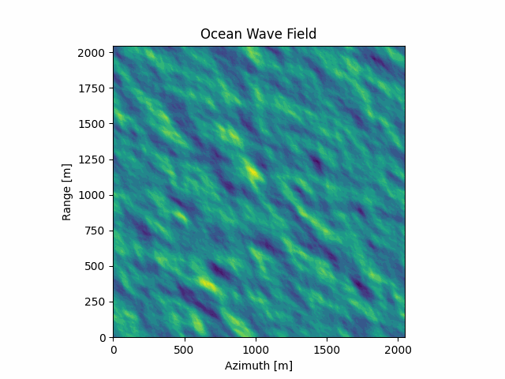

# OceanSARImagingSimulator

This repository is work conducted by me as part of my thesis project in [Chalmers University of Technology](https://www.chalmers.se/en/) for the [Communication Engineering MSc. program](https://www.chalmers.se/en/education/find-masters-programme/information-and-communication-technology-msc/).

Thesis title: Linear and nonlinear mapping of sea surface waves imaged by synthetic aperture radar

Project worker: Eltjon Qefalija

Supervisor: Anis El Youncha

Examiner: Leif Eriksson



## Installation
### Clone
```bat
git clone https://github.com/eltjonqef/OceanSARImagingSimulator
cd OceanSARImagingSimulator
```
### Virtual Environment
```bat
python3 -m venv venv
```
#### Linux/MacOS
```bat
source venv/bin/activate
```
#### Windows
```bat
venv\Scripts\activate
```
### Requirements
```bat
pip3 install -r requirements.txt
```
## Execution
### Single Simulation
```bat
python3 simulation.py parameter_file.yml output_folder
```
### Parallel Simulations
```bat
python3 parallel_simulations.py config_folder output_folder
```
## License

The code is licensed under the MIT License.


